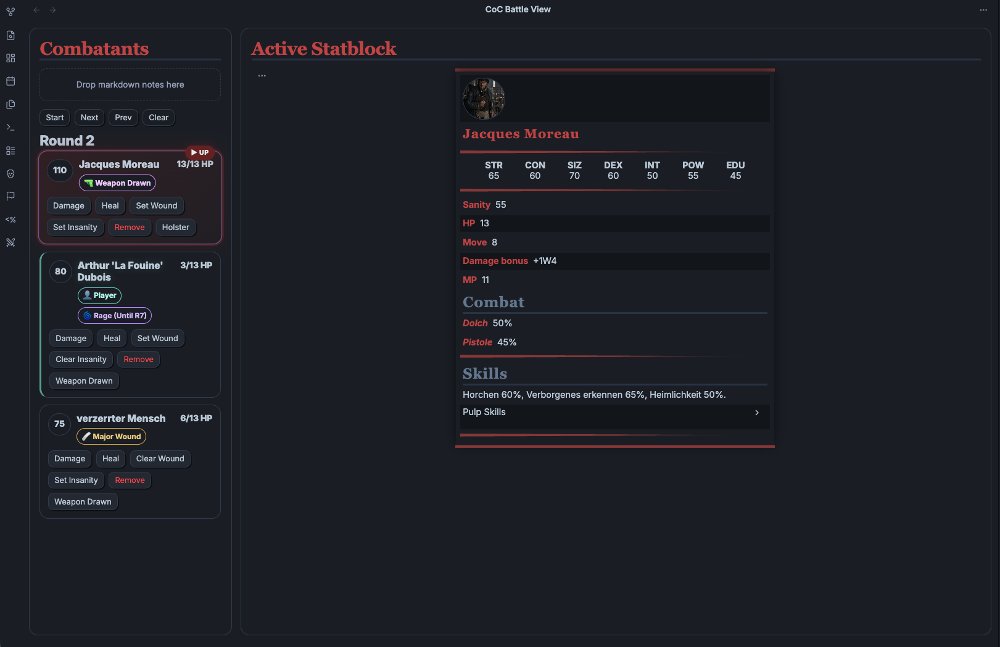
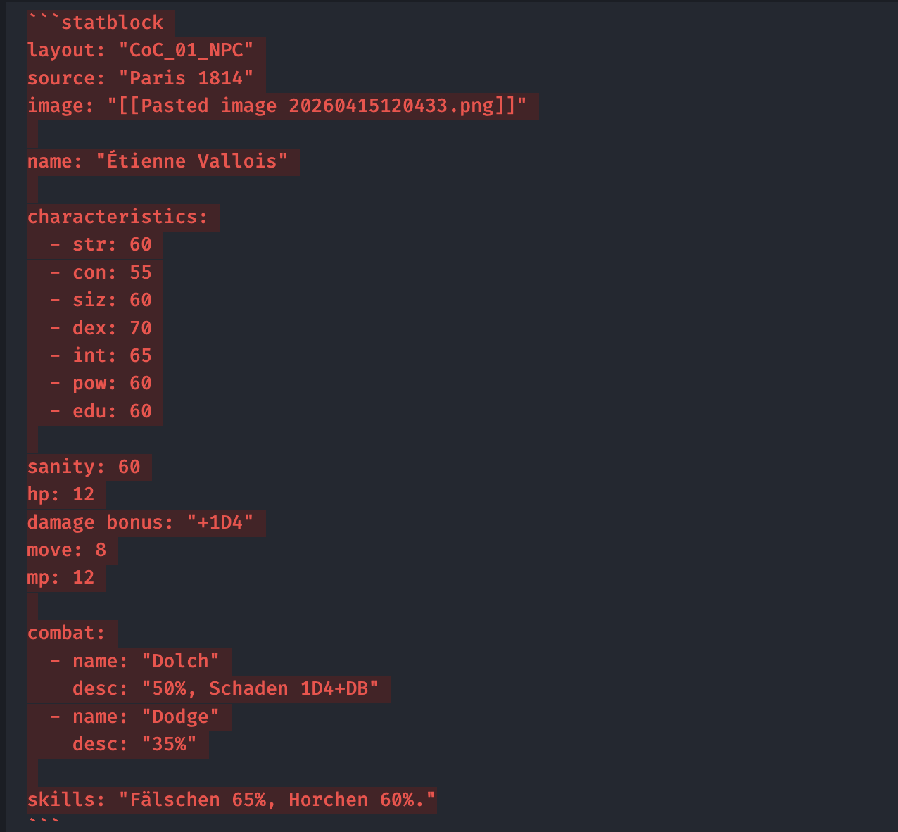

# CoC Battle View

A small Obsidian plugin scaffold for Call of Cthulhu 7e combats.

## What it does
 
- Opens a **Battle View** tab
- Lets you **drag markdown notes** with a `statblock` code fence into the view
- Parses the `name`, `dex`, `hp`, and `combat` entries from the statblock
- Sorts combatants by DEX / initiative
- Tracks rounds and current turn
- Lets you subtract or heal HP without changing the original note
- Renders the **original markdown note** in the center panel so your real statblock remains visible
- Applies rules for wounds, death and unconsciousness and lables these states
- Lets you apply Insanity and display an insanity lable for X rounds
- Is keeping players in the battelview permanently and labeling them as players if the statblock gets dropped into the view from a folder containing "player"
- Lets you apply the "drawn weapon" Modifier to set the initiative to dex+50



## Expected statblock format

The parser expects a code block like:

## build 
```npm build```

## Install for testing


Copy these files into:

`.obsidian/plugins/coc-battle-view/`

- manifest.json
- main.ts
- styles.css


